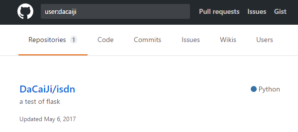
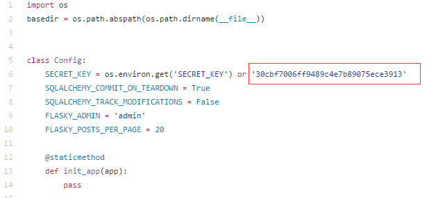
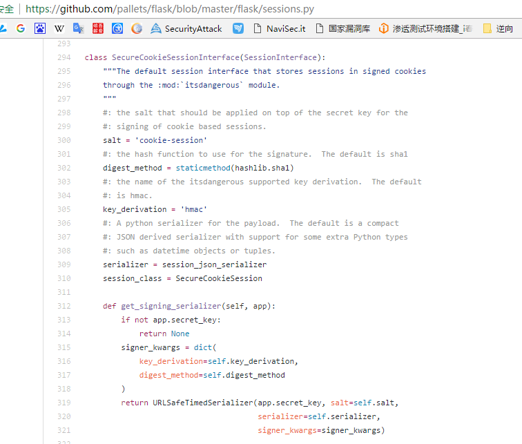
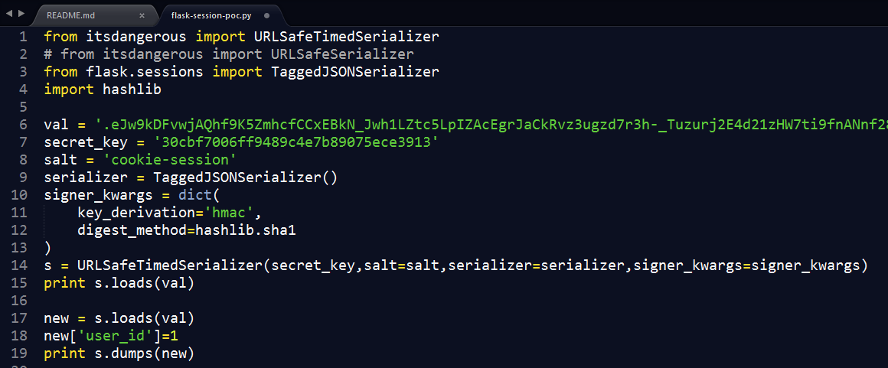
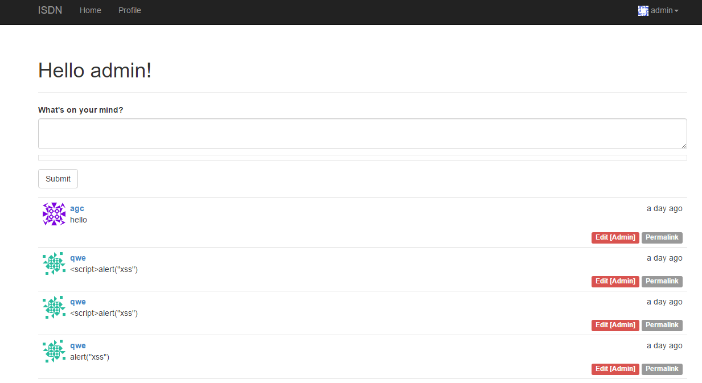
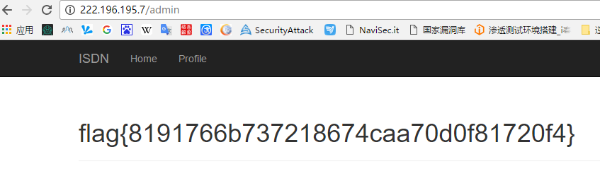

## Web 04  blog blog blog
#### 提示git，让找github源码  

  
  
#### Config.py中出现固定的secret_key，这会导致构造session越权，并且管理员是 admin  

  
  
#### 我们需要在flask中把session加密算法抠出来  
#### https://github.com/pallets/flask/blob/master/flask/sessions.py  

  
  
#### 通过flask加密算法自己构造session  

  
  
#### 注册一个账号，登录时抓包val中填自己的session  
#### 运行脚本生成id为1的用户的session，并不是admin，写个脚本遍历找到admin的id  
#### 找到admin会发现，admin权限比其他用户高，可以编辑和删除别人的留言  

  
   
#### 现在可以访问admin页面了  

